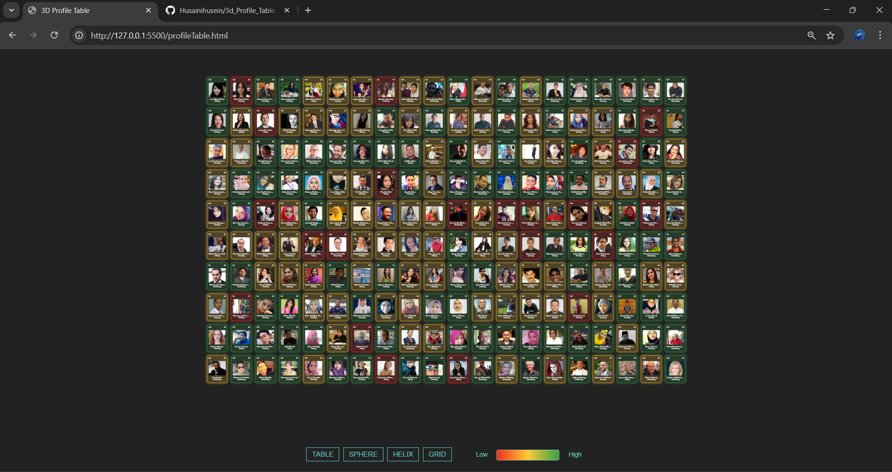

# 3D Periodic Table Internship Demo

Interactive 3D “periodic table” that visualizes data from a Google Sheet using Three.js CSS3D. Users must log in via Google to view the table.

---

## 🌐 Live Demo

[View Live Demo](https://yourusername.github.io/3d_Profile_Table/periodicTable.html)

---

## ⚡ Features

- Google OAuth login to access the table
- Data fetched dynamically from a Google Sheet CSV
- Four interactive layouts:
  - **Table** (20x10)
  - **Sphere**
  - **Double Helix**
  - **Grid** (5x4x10)
- Tiles color-coded based on Net Worth:
  - Red: < $100K
  - Yellow: $100K – $200K
  - Green: > $200K
- Shows user info: Name, Age, Country, Photo, Interest

---

## 📖 How to Use

1. Open the **Live Demo** link above.
2. Sign in with Google.
3. Use the buttons at the bottom to switch between layouts.

---

## 🖼 Screenshots

---

## 🛠 Technologies & Libraries

- [Three.js](https://threejs.org/) (CSS3DRenderer)
- [Google Identity Services](https://developers.google.com/identity/gsi/web) (OAuth)
- HTML, CSS, JavaScript

---

